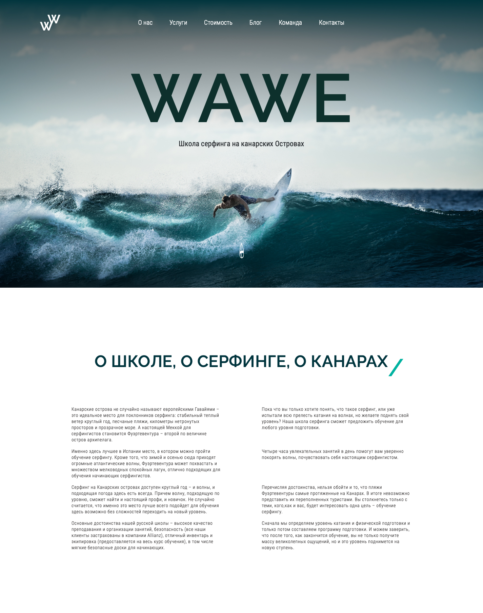
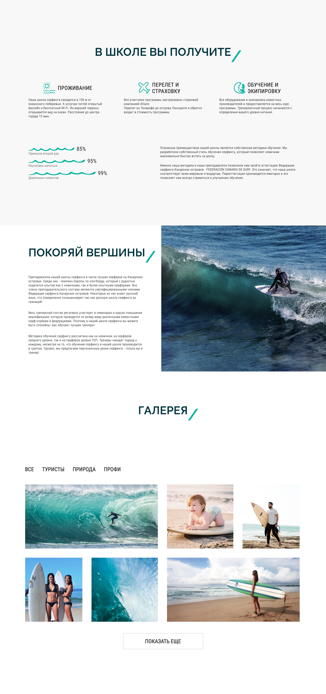
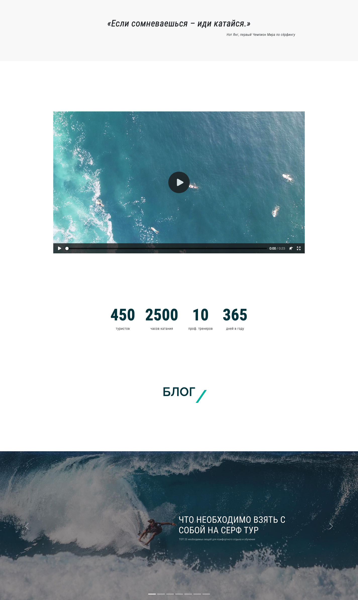
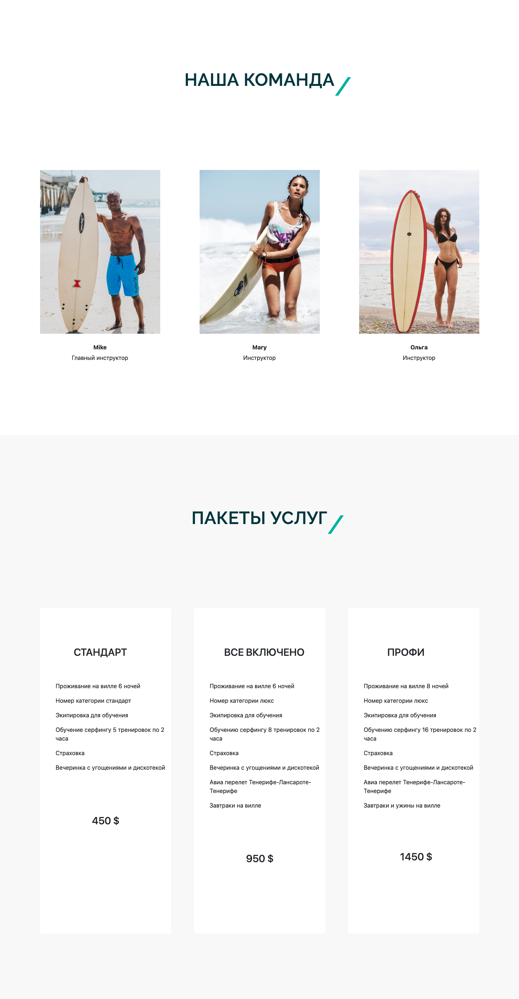
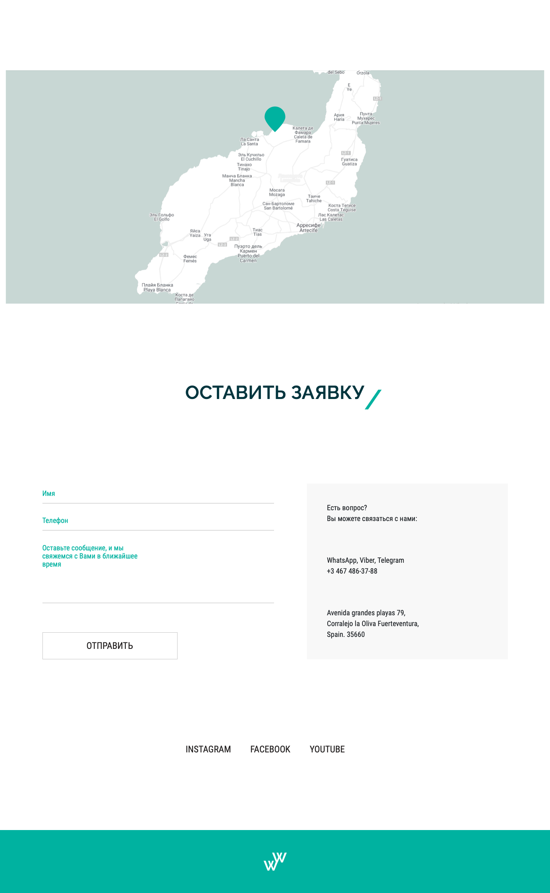

# Wawe

Website for the Wawe surf school.  
The website is adapted for desktop, tablets and mobile devices.
 

## Result:

https://aelita-dzhafarova.github.io/wawe-2/

## Technologies:
<code></code>
<code></code>
<code></code>

## Authors:
<table>
  <tr>

<td align="center"><a href="https://github.com/aelita-dzhafarova"> <b>Aelita</b></a></td>
<td align="center"><a href="https://github.com/goncharovastacy"> <b>Anastasia</b></a></td>
<td align="center"><a href="https://github.com/Zarrina0207"><b>Zarrina</b></a></td>

 </tr>
</table>

## Figma: 
https://buildhtml.ru/template/234
